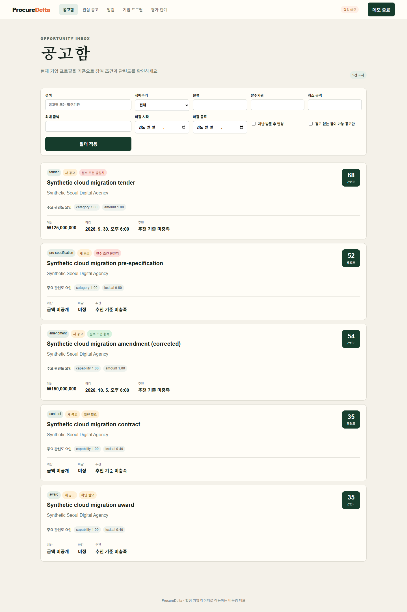

# ProcureDelta

**공고를 한 번 요약하는 대신, 사전규격부터 변경·낙찰·계약까지의 연결과 조건 변화를 추적하는 조달 인텔리전스 시스템입니다.**

FastAPI · PostgreSQL/Alembic · Redis/ARQ · Next.js/TypeScript 기반의 개인 개발 프로젝트입니다.
현재 전체 5단계 생애주기 데모는 **합성 데이터**이며, 실제 공개 API 어댑터는 **나라장터 용역 입찰공고와 관측 변경 상태**까지 구현되어 있습니다. 실제 고객·기업 내부 자료·결제 정보는 사용하지 않습니다.

## Live Demo

**https://procure-delta-demo.onrender.com**

공개 웹 데모는 비용 없는 포트폴리오 시연을 위해 `NEXT_PUBLIC_STATIC_DEMO=true`인 **읽기전용 합성 데이터 모드**로 배포합니다. 실제 FastAPI · PostgreSQL · Redis/ARQ 전체 경로는 아래 Docker release gate와 GitHub CI에서 별도로 검증하며, 공개 웹이 실제 나라장터·외부 LLM·실제 알림을 호출하는 것처럼 표시하지 않습니다.


## 문제 정의

일반적인 공고 추천은 “현재 문서가 우리 회사와 맞는가”만 봅니다. 실제 조달 업무에서는 그 이후가 더 어렵습니다.

- 사전규격이 정식 공고로 바뀌었는가
- 예산·마감·참가조건·첨부문서가 바뀌었는가
- 그 변경이 우리 회사의 참여 가능성과 우선순위에 어떤 영향을 주는가
- 관심 공고의 낙찰·계약 결과가 연결됐는가
- 수집·파싱·추출·추천·알림 파이프라인이 실패했을 때 재현 가능한가

ProcureDelta는 이 흐름을 **raw-first 수집 → 버전 관리 → 문서 처리 → 검증된 추출 → 생애주기 연결 → Delta → eligibility → ranking → 알림**으로 나눕니다.

## 제품 흐름

```text
공개 소스 / 합성 소스
        ↓
raw payload 보존 + idempotent ingest
        ↓
정규화 + immutable opportunity versions
        ↓
첨부 다운로드 → native parse / OCR fallback
        ↓
structured extraction + evidence validation
        ↓
lifecycle linking + deterministic Delta Engine
        ↓
company hard eligibility → ranking
        ↓
watch → outbox → notification receipt / retry / DLQ
```



### 핵심 설계

- **Raw first** — 외부 payload를 먼저 보존하고, 정규화 실패가 원문 손실로 이어지지 않게 했습니다.
- **Append-only versioning** — 늦게 도착한 과거 자료는 이력에 남지만 최신 상태를 되돌리지 않습니다.
- **Deterministic Delta** — 예산·마감·자격·첨부 변화는 LLM이 아니라 규칙 기반 비교와 근거 포인터로 계산합니다.
- **Eligibility before ranking** — 필수 조건 실패나 미확인 상태를 관련도 점수가 뒤집지 못합니다.
- **Evidence-validated extraction** — 구조화 출력은 스키마·페이지·quote·원문 충돌 검증을 통과해야 downstream 판단에 사용됩니다.
- **Durable async pipeline** — Redis/ARQ 작업이 유실돼도 PostgreSQL 상태를 기준으로 reconcile하며, bounded retry와 DLQ를 남깁니다.
- **Operational visibility** — 관리자 콘솔에서 ingest, parser/OCR/extraction, queue, retry/DLQ, source freshness, runtime 상태를 확인합니다.


## 검증 상태

2026-09-18, 원본 `.env`와 기존 DB 볼륨을 사용하지 않는 **격리 Docker 통합 검증**을 실행했고 최종 release gate가 `passed=true`로 종료됐습니다.

통과한 범위:

- Compose contract / image build
- PostgreSQL + Redis
- backend lint / strict mypy / DB isolation regression / backend tests
- source contracts / evaluation / fault drill
- runtime start / full readiness
- web install / unit tests / typecheck / lint
- 실제 브라우저 lifecycle E2E
- Redis queue scale gate
- PostgreSQL query-plan gate
- HTTP load gate
- background worker/scheduler pause → resume

Readiness snapshot에서 database, schema, redis, worker, scheduler, storage, extraction config가 모두 `true`였습니다.
원본 결과는 [`artifacts/verification/release-gate.json`](artifacts/verification/release-gate.json), 검증 방식은 [`docs/verification.md`](docs/verification.md)에 있습니다.

## 평가 결과

아래 숫자는 **작은 합성 회귀셋과 로컬 측정**입니다. 실제 조달 문서 전체에 대한 성능이나 수주 확률로 해석하지 않습니다.

| 검사 | 관측값 | 범위 |
|---|---:|---|
| 명시 라벨 추출 | 30/30 필드 | 정상 합성 문서 5개; 별도 거절 사례 5개 |
| Delta 필드 탐지 | 7 TP, 0 FP, 0 FN | 합성 비교 8쌍 |
| 생애주기 연결 | 2개 정확 연결, 3개 미해결 | 합성 사례 5개 |
| 별도 Tesseract OCR | 17/18 필드 | 영어 합성 이미지 3장; 한국어 OCR 성능이 아님 |
| 과거 시점 재생 | 3개 시점 | 미래·지연 수집·미래 추출·미래 기업 프로필 제외 |
| CPU 파이프라인 | 50,000 정규화·순위 + 5,000 Delta | 약 6.995초; DB·Redis·HTTP·LLM 제외 |

측정 원본: [`artifacts/evaluation/local.json`](artifacts/evaluation/local.json), [`artifacts/performance/cpu.json`](artifacts/performance/cpu.json), [`artifacts/failures/http.json`](artifacts/failures/http.json).

## 로컬 실행

Docker Desktop이 실행되는 환경에서:

```bash
cp .env.example .env
# Windows PowerShell: Copy-Item .env.example .env

docker compose up --build -d
docker compose exec api python -m app.demo.seed --run-id review --phase base
```

- Web: `http://localhost:3000`
- API readiness: `http://localhost:8000/health/ready`

변경과 결과 연결을 순서대로 시연하려면:

```bash
docker compose exec api python -m app.demo.seed --run-id review --phase amendment
docker compose exec api python -m app.demo.seed --run-id review --phase outcome
```

전체 격리 통합 검증:

```bash
python scripts/verify_containers.py
```

## 실제 나라장터 어댑터

현재 실제 adapter는 조달청 나라장터 **용역 입찰공고 조회와 관측 변경 상태**까지 연결되어 있습니다. 사전규격·낙찰·계약의 실제 수집기는 아직 구현 범위 밖이며, 합성 5단계 데모와 구분합니다.

키 없이 합성 계약 확인:

```bash
docker compose run --rm --no-deps api python -m app.sources.koneps_smoke --fixture
```

공식 서비스키가 있는 로컬 환경에서만 실제 smoke를 명시적으로 실행합니다.

```bash
docker compose run --rm --no-deps api python -m app.sources.koneps_smoke --live --max-pages 2
```

서비스키는 커밋·로그·결과 JSON에 기록하지 않습니다. 자세한 계약은 [`docs/source-contracts.md`](docs/source-contracts.md)를 참고하세요.

## 기술 구성

- **Backend**: Python 3.12+, FastAPI, SQLAlchemy async, Alembic, Pydantic v2
- **Data/Queue**: PostgreSQL 16, Redis 7, ARQ
- **Frontend**: Next.js 16, React 19, TypeScript strict
- **Document/AI**: PyMuPDF, OCR adapter boundary, deterministic extractor, provider-neutral structured extraction adapter
- **Quality**: pytest, Ruff, strict mypy, ESLint, TypeScript, Playwright E2E
- **Infra**: Docker Compose, GitHub Actions

## 범위와 한계

- 전체 5단계 lifecycle 데모는 합성입니다.
- 실제 나라장터 키 기반 호출은 별도 smoke가 필요하며, 실제 사전규격·낙찰·계약 수집은 미구현입니다.
- HWP 내용 추출과 실제 한국어 OCR 품질은 아직 검증하지 않았습니다.
- ranking 가중치와 threshold는 제품 동작 검증용 deterministic baseline이며, 수주확률 모델이 아닙니다.
- 결제·구독, 운영용 인증/기관 격리, 외부 Sentry 연동, 클라우드 운영은 별도 운영화 과제입니다.
- 외부 LLM은 기본 비활성입니다. 실행하지 않은 정확도·비용 수치를 README에 적지 않습니다.

자세한 내용은 [`docs/limitations.md`](docs/limitations.md)를 참고하세요.

## 문서

- [Architecture](docs/architecture.md)
- [Data pipeline](docs/data-pipeline.md)
- [Source contracts](docs/source-contracts.md)
- [Extraction](docs/extraction.md)
- [Delta Engine](docs/DELTA_ENGINE.md)
- [Ranking](docs/RANKING.md)
- [Notifications](docs/notifications.md)
- [Evaluation](docs/evaluation.md)
- [Performance](docs/performance.md)
- [Operations](docs/operations.md)
- [Verification](docs/verification.md)
- [Limitations](docs/limitations.md)

Copyright © 2026 윤기혁. All rights reserved. Portfolio project.
