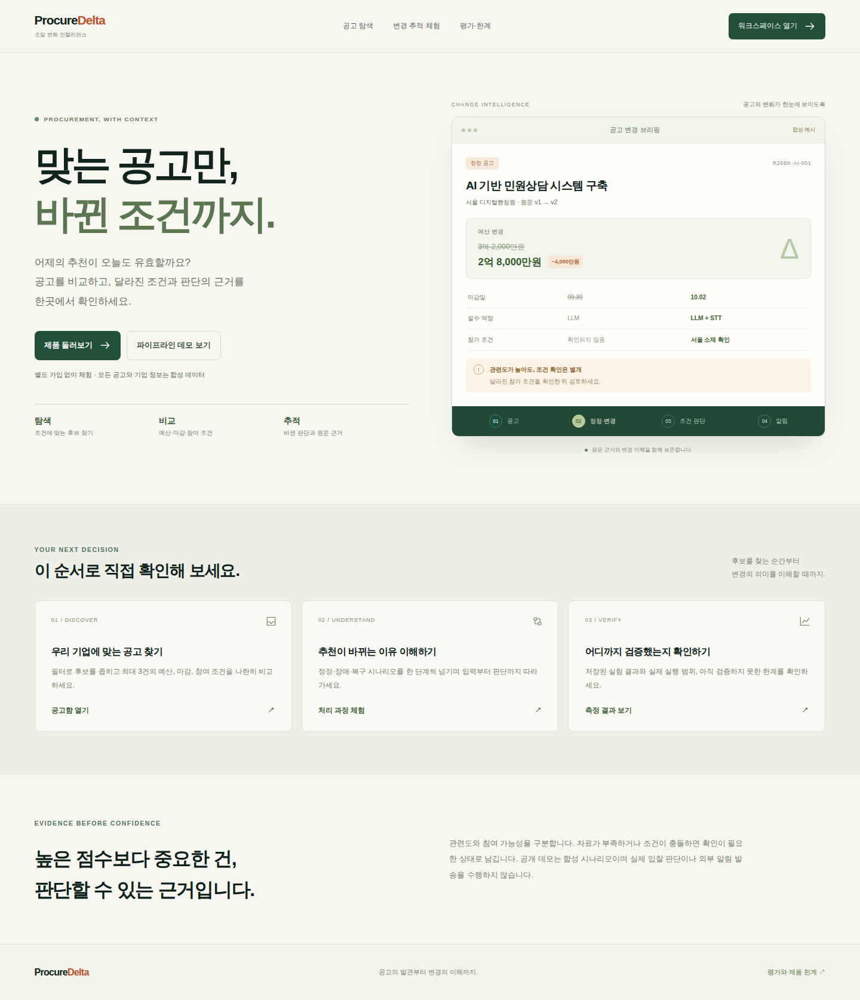
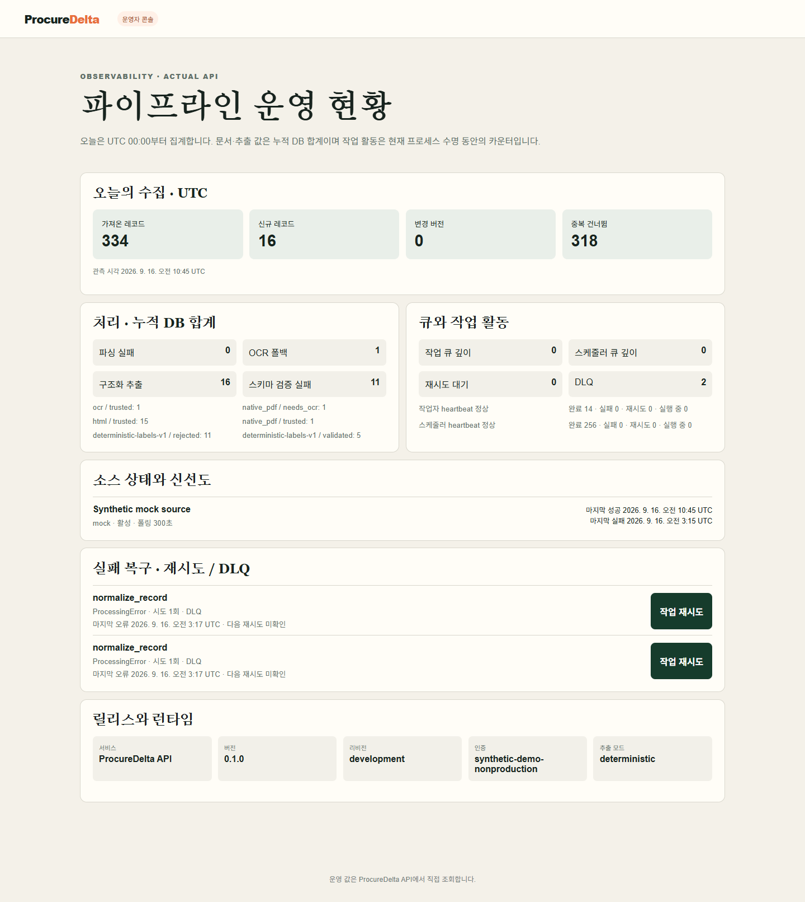

# ProcureDelta

**공고를 한 번 요약하는 대신, 수집부터 정정·변경·낙찰·계약까지의 연결과 조건 변화를 추적하는 B2B 조달 인텔리전스 시스템입니다.**

FastAPI · PostgreSQL/Alembic · Redis/ARQ · Next.js/TypeScript 기반의 개인 개발 프로젝트입니다.

현재 전체 5단계 lifecycle은 **합성 데이터로 재현**하며, 실제 공개 API adapter는 **나라장터 용역 입찰공고와 관측 변경 상태**까지 구현되어 있습니다. 실제 고객·기업 내부 자료·결제 정보는 사용하지 않습니다.

## Live Demo

**https://procure-delta-demo.onrender.com**

공개 웹은 비용 없는 포트폴리오 시연을 위해 `NEXT_PUBLIC_STATIC_DEMO=true`인 **서버 비영속 합성 데이터 모드**로 배포합니다. 프로필·관심공고·알림설정 변경은 브라우저 메모리에서만 유지되며 서버/DB에는 저장되지 않습니다.

- Pipeline Control Room의 시나리오와 contract는 실제 backend 구현과 맞춰 둡니다.
- 화면에 보이는 performance 값은 저장된 격리 검증 snapshot입니다.
- 공개 웹이 현재 나라장터를 polling하거나 hosted LLM/OCR/Redis worker/외부 알림을 실시간 실행하는 것처럼 표시하지 않습니다.
- 실제 FastAPI · PostgreSQL · Redis/ARQ 경로는 Docker release gate와 GitHub Actions에서 별도로 검증합니다.



## 60초 데모

면접관이 프로젝트를 처음 봤을 때 가장 먼저 볼 동선입니다.

1. **파이프라인**으로 이동
2. **정정으로 조건 변경** 선택
3. **재생** 클릭
4. **Delta** 단계에서 이전/현재 값과 deterministic reason code 확인
5. **참여 조건**에서 참여 가능 → 불가로 바뀐 이유 확인
6. 관련도 점수가 높아도 hard eligibility를 뒤집지 못하는지 확인
7. **Scale / Failure / HTTP / Query Plan** 카드에서 실제 측정 범위 확인
8. **평가·한계**에서 deterministic / hosted / OCR 측정 여부 확인

핵심은 이 한 줄입니다.

```text
collect → dedupe → normalize → document/OCR → structured extraction
→ validation → lifecycle → Delta → eligibility → ranking → notification
```


## 왜 이 구조인가

일반적인 공고 AI 데모는 “문서를 올리고 요약하거나 질문한다”에서 끝나는 경우가 많습니다.

ProcureDelta는 한 공고가 시간이 지나며 바뀌는 문제를 중심으로 잡았습니다.

- 사전규격이 공고로 이어졌는가
- 같은 공고의 정정이 새 version으로 들어왔는가
- 예산·마감·지역·필수 인증·첨부가 무엇이 바뀌었는가
- 그 변화가 우리 회사의 **참여 가능 여부**를 바꿨는가
- 참여 가능 여부와 별개로 **관련도 순위**는 어떻게 변했는가
- 관심 공고라면 어떤 알림 판단이 생기는가
- 수집·파싱·추출·queue가 실패했을 때 retry/DLQ 경계가 무엇인가
- 과거 시점 판단을 replay할 때 미래 정보를 섞지 않았는가

즉, 챗봇이 아니라 **외부 데이터가 서비스 판단으로 바뀌는 전체 lifecycle**을 구현 대상으로 삼았습니다.

## 제품 / 데이터 흐름

```text
공개 source / 합성 source
        ↓
raw payload 보존 + idempotent ingest
        ↓
dedupe + normalization + immutable opportunity versions
        ↓
attachment download → native parse / OCR routing
        ↓
structured extraction + schema/evidence validation
        ↓
lifecycle linking + deterministic Delta Engine
        ↓
company hard eligibility
        ↓
relevance ranking
        ↓
watch / outbox / notification receipt / retry / DLQ
```

### 설계에서 의도적으로 분리한 것

- **Raw first** — 외부 payload를 먼저 보존하고 정규화 실패가 원문 손실로 이어지지 않게 했습니다.
- **Append-only versioning** — 늦게 도착한 과거 자료는 이력에 남지만 최신 상태를 되돌리지 않습니다.
- **Deterministic Delta** — 예산·마감·지역·자격·첨부 변화는 LLM 설명이 아니라 규칙 기반 비교와 evidence pointer로 계산합니다.
- **Eligibility before ranking** — 필수 조건 실패나 미확인 상태를 관련도 점수가 뒤집지 못합니다.
- **Evidence-validated extraction** — 구조화 출력은 schema·원문 근거·conflict 검증을 통과해야 downstream 판단에 들어갑니다.
- **Durable async pipeline** — Redis/ARQ 작업과 PostgreSQL 상태를 분리하고 bounded retry, reconcile, DLQ 경계를 둡니다.
- **Historical replay** — `effective_at / observed_at / created_at / available_at`을 구분해 당시 알 수 없던 정보를 과거 판단에 넣지 않습니다.
- **Operational visibility** — source freshness, parser/OCR/extraction, queue, retry/DLQ, runtime 상태를 운영자 화면에서 확인합니다.



## Pipeline Control Room

Reviewer-facing `/pipeline`은 실제 기능을 단순한 아키텍처 그림이 아니라 **단계별로 열어볼 수 있는 replay**로 보여줍니다.

### 1. 신규 공고

최초 관측이 들어와 정규화·문서 처리·추출·검증·eligibility·ranking·알림 판단으로 이어집니다. 최초 version이므로 Delta는 비교 대상 없음으로 표시합니다.

### 2. 정정으로 조건 변경

가장 중요한 시나리오입니다.

```text
amendment
→ immutable new version
→ Delta
→ hard eligibility changed
→ ranking cannot override the hard failure
→ notification decision
```

각 단계에서 **입력 / 출력 / 근거 / 판단**을 볼 수 있습니다.

### 3. 장애와 복구

저장된 synthetic transport failure 결과를 이용해 다음 경계를 보여줍니다.

- timeout → bounded retry 후 회복
- 429 → retry 후 회복
- 반복 5xx → bounded attempts 후 terminal
- 403 → non-retry

실제 공공 API 장애가 발생했다고 주장하지 않습니다.

## 검증된 engineering evidence

공개 performance 카드는 **GitHub Actions run 35565162198**의 격리 Docker 측정을 reference snapshot으로 고정한 것입니다. CI마다 달라지는 timing을 가장 잘 나온 값으로 계속 갈아끼우지 않습니다.

| 영역 | 관측값 | 범위 |
|---|---:|---|
| CPU production functions | 50,000 normalize/rank + 5,000 Delta, 약 7,148 records/s | DB·Redis·HTTP·OCR·LLM 제외 |
| Redis/ARQ/PostgreSQL | 1,000/1,000 완료, 46.59s, 약 21.46 records/s | 합성 ingest, 문서/OCR/외부 LLM 제외 |
| Local HTTP | 총 200요청, 200성공, 0실패 | endpoint별 50요청, concurrency 5 |
| inbox HTTP p95 | 약 1,219.2 ms | local container / synthetic data |
| search HTTP p95 | 약 1,210.4 ms | local container / synthetic data |
| detail HTTP p95 | 약 195.7 ms | local container / synthetic data |
| admin HTTP p95 | 약 71.6 ms | local container / synthetic data |
| PostgreSQL query experiment | 0.331 → 0.041 ms, 이번 실행 약 8.07× | 1,007 rows, fixed-order/warm-cache |
| candidate index | 미채택, rollback 확인 | 단일 실험을 migration 근거로 사용하지 않음 |

자세한 조건은 [Performance](docs/performance.md)에 기록했습니다.

## AI / OCR 평가

평가 화면은 “AI를 썼다”가 아니라 **어떤 경로를 실제 측정했고 어떤 경로를 실행하지 않았는지**를 구분합니다.

| 경로 | 상태 | 관측 |
|---|---|---|
| deterministic extraction | 측정됨 | 30/30 labeled fields, 작은 합성 회귀셋 |
| OCR | 측정됨 | Tesseract 17/18 fields, 영어 합성 이미지 3장 |
| hosted all | **미실행** | 정확도·latency·token·cost 없음 |
| hosted gated | **미실행** | 정확도·latency·token·cost 없음 |

Delta는 합성 비교 8쌍에서 expected changed field 7개를 검증했고, lifecycle link는 합성 사례 5개 중 2개를 resolve하고 ambiguous/missing/incompatible 사례는 unresolved로 남겼습니다.

이 숫자는 일반화 benchmark가 아니라 **작은 작성자 제작 regression set**입니다.


## Release gate

현재 저장된 `artifacts/verification/release-gate.json`은 **2026-09-21 GitHub Actions run 35568528869**의 격리 통합 검증 결과이며 `passed=true`입니다. 이후 Pipeline 변경이 병합된 `main` SHA `47d24ad5`에서도 run **35575659698**이 backend/frontend/release-contract 전체 성공했습니다.

통과 범위:

- Compose contract / image build
- PostgreSQL + Redis
- Ruff / strict mypy / DB isolation regression / backend tests
- source contracts / evaluation / fault drill
- runtime start / full readiness
- frontend test / typecheck / lint
- 실제 browser lifecycle E2E
- **Pipeline Control Room desktop/mobile/reduced-motion E2E**
- Redis/ARQ queue scale
- PostgreSQL query-plan experiment
- local HTTP load
- worker/scheduler pause → resume

Readiness snapshot에서 database, schema, redis, worker, scheduler, storage, extraction_config가 모두 `true`였습니다.

검증 방식: [Verification](docs/verification.md)

## 로컬 실행

Docker Desktop이 실행되는 환경에서:

```bash
cp .env.example .env
# Windows PowerShell: Copy-Item .env.example .env

docker compose up --build -d
docker compose exec api python -m app.demo.seed --run-id review --phase base
```

- Web: `http://localhost:3000`
- Pipeline: `http://localhost:3000/pipeline`
- API readiness: `http://localhost:8000/health/ready`

정정과 outcome lifecycle을 순서대로 시연:

```bash
docker compose exec api python -m app.demo.seed --run-id review --phase amendment
docker compose exec api python -m app.demo.seed --run-id review --phase outcome
```

전체 격리 통합 검증:

```bash
python scripts/verify_containers.py --scale-records 1000
```

## 실제 나라장터 adapter

현재 실제 adapter는 조달청 나라장터 **용역 입찰공고 조회와 관측 변경 상태**까지 연결되어 있습니다.

사전규격·낙찰·계약의 실제 collector는 아직 구현하지 않았으며, 합성 5단계 lifecycle과 구분합니다.

키 없이 source contract 확인:

```bash
docker compose run --rm --no-deps api python -m app.sources.koneps_smoke --fixture
```

공식 서비스키가 있는 로컬 환경에서만 live smoke를 명시적으로 실행합니다.

```bash
docker compose run --rm --no-deps api python -m app.sources.koneps_smoke --live --max-pages 2
```

서비스키는 커밋·로그·결과 JSON에 기록하지 않습니다.

자세한 계약: [Source contracts](docs/source-contracts.md)

## 기술 구성

- **Backend**: Python 3.12+, FastAPI, SQLAlchemy async, Alembic, Pydantic v2
- **Data/Queue**: PostgreSQL 16, Redis 7, ARQ
- **Frontend**: Next.js 16, React 19, TypeScript strict
- **Document/AI**: PyMuPDF, OCR adapter boundary, deterministic extractor, provider-neutral structured extraction adapter
- **Quality**: pytest, Ruff, strict mypy, ESLint, TypeScript, Playwright
- **Infra**: Docker Compose, GitHub Actions

## 범위와 한계

- 전체 5단계 lifecycle demo는 합성입니다.
- 실제 나라장터 연동은 현재 용역 입찰공고와 관측 변경 범위입니다.
- 실제 사전규격·낙찰·계약 collector는 아직 없습니다.
- HWP 내용 추출과 실제 한국어 OCR 품질은 검증하지 않았습니다.
- hosted LLM은 현재 평가하지 않았으므로 정확도·비용·token 수치를 주장하지 않습니다.
- ranking은 deterministic baseline이며 수주확률 모델이 아닙니다.
- performance snapshot은 격리 합성 실행이며 production capacity가 아닙니다.
- 공개 Render web은 서버 비영속 static synthetic demo이며 full cloud backend 운영 증거가 아닙니다.
- 결제·구독, 운영용 인증/기관 격리, 무중단 운영은 별도 운영화 과제입니다.

자세한 내용: [Limitations](docs/limitations.md)

## 문서

- [Architecture](docs/architecture.md)
- [Data pipeline](docs/data-pipeline.md)
- [Source contracts](docs/source-contracts.md)
- [Extraction](docs/extraction.md)
- [Delta Engine](docs/DELTA_ENGINE.md)
- [Ranking](docs/RANKING.md)
- [Notifications](docs/notifications.md)
- [Evaluation](docs/evaluation.md)
- [Performance](docs/performance.md)
- [Operations](docs/operations.md)
- [Verification](docs/verification.md)
- [Limitations](docs/limitations.md)

Copyright © 2026 윤기혁. All rights reserved. Portfolio project.
